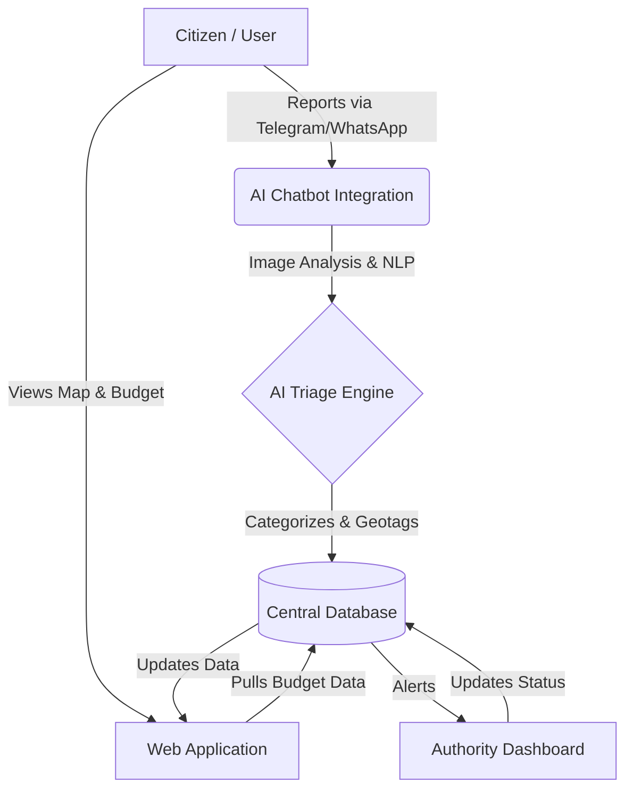
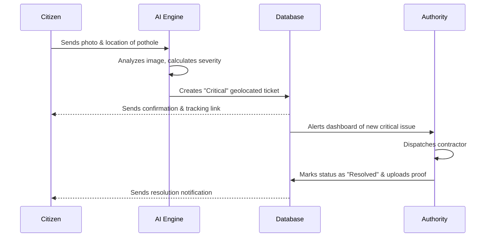

# RoadWatch

RoadWatch is a powerful civic transparency and road infrastructure monitoring platform. It empowers citizens to report road issues (potholes, waterlogging, cracks) in seconds and allows them to monitor exactly how public money is being spent on repairs.

## 🚀 Features

- **Geo-tagged Reports**: Pinpoint exact locations with GPS and AI image analysis.
- **AI Triage Feed**: Real-time AI classification feed that automatically categorizes issues by severity (Critical, Moderate, Minor) based on uploaded photos.
- **Spending Insight**: A detailed budget dashboard showing funds sanctioned vs. funds used for specific road projects, holding contractors accountable.
- **Verified Repairs**: Interactive before/after photo slider showcasing AI-verified repairs to demonstrate public spending at work.
- **Authority Dashboard**: A comprehensive management panel for authorities to track KPIs, view open complaints, and update repair statuses.
- **Interactive Live Map**: View real-time infrastructure issues overlaid on a map with a heat-map toggle and location-based search using OpenStreetMap Nominatim.

## 📊 Architecture & Workflows

### System Architecture


### Incident Resolution Workflow


## 🛠️ Tech Stack

- **Framework**: React + Vite
- **Routing**: TanStack Router
- **Styling**: Tailwind CSS
- **UI Components**: Shadcn UI + Lucide Icons
- **Maps**: Leaflet + React Leaflet
- **Geocoding API**: OpenStreetMap Nominatim

## 💻 Getting Started

### Prerequisites
Make sure you have Node.js and npm installed.

### Installation

1. Clone the repository:
   ```bash
   git clone https://github.com/debjyotydasgupta-collab/Roadwatch.git
   cd Roadwatch
   ```

2. Install dependencies:
   ```bash
   npm i
   npm i --legacy-peer-deps
   ```

3. Set up environment variables:
   Create a `.env` file in the root directory (this is ignored by Git for security) and add your necessary environment variables.

4. Start the development server:
   ```bash
   npm run dev
   ```

5. Open your browser and navigate to `http://localhost:8080`.

## 📂 Project Structure

- `src/routes/` - TanStack file-based routing components (`index.tsx`, `map.tsx`, `dashboard.tsx`, `budget.tsx`, etc.)
- `src/components/` - Reusable UI components including the responsive Navbar, MapView, and Shadcn UI primitives.
- `src/lib/` - Utility functions, mock API logic, and configuration.
- `src/hooks/` - Custom React hooks for global state management (e.g., authentication, region selection).

## 🤝 Contributing

Contributions, issues, and feature requests are welcome! Feel free to check the issues page if you want to contribute.

## 📝 License

This project is licensed under the MIT License.
